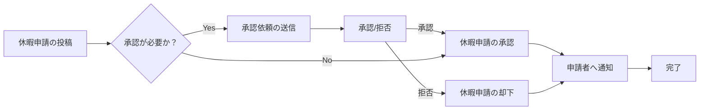

# Microsoft Teams 業務効率化レシピ集: Power Automate & Bot 活用で日々のルーチンワークを自動化

この記事では、Microsoft Teams を活用して日々のルーチンワークを自動化し、業務効率を劇的に向上させるための実践的なレシピ集を紹介します。Power Automate と Microsoft Bot Framework Composer を用いて、申請・承認プロセスの自動化、問い合わせ対応の自動化、その他様々な業務の自動化を実現する方法を、具体的な実装例やコード例を交えながら解説します。この記事を読むことで、Teams 環境を最大限に活用し、より創造的な業務に集中できるようになるでしょう。

## 1. Teams × Power Automate 超入門: 承認ワークフロー自動化で申請・承認プロセスを劇的に改善

### 1.1. Power Automate for Teams の基本: テンプレート活用とトリガー/アクションの理解

Power Automate for Teams は、Teams 内で発生する様々なイベントをトリガーとして、様々なアクションを実行できる強力なツールです。まずは、Power Automate の基本概念であるトリガーとアクションを理解しましょう。

*   **トリガー:** フローを開始するイベント（例：新しいメッセージの投稿、アイテムの作成）
*   **アクション:** トリガーに応じて実行される処理（例：承認依頼の送信、ファイルの作成）

Teams には、休暇申請や経費申請など、よく利用されるワークフローのテンプレートが多数用意されています。これらのテンプレートを活用することで、簡単にワークフローを構築できます。

### 1.2. 承認ワークフロー構築実践: 休暇申請、経費申請、購買申請の自動化 (具体的なフロー図、サンプル)

ここでは、休暇申請ワークフローを例に、具体的な構築手順を解説します。

**フロー図:**



**サンプル:**

1.  **トリガー:** Teams チャネルに新しいメッセージが投稿されたとき
2.  **アクション:**
    *   メッセージの内容を解析し、休暇申請であるか判断
    *   承認者に承認依頼を送信 (Teams の承認機能を使用)
    *   承認結果に応じて、申請者に通知を送信

**Power Automate の画面イメージ:**

(Power Automate の画面イメージを挿入する場所。トリガーとアクションの設定画面のスクリーンショット。)

### 1.3. 応用: 条件分岐、承認者の動的設定、承認結果のTeams通知カスタマイズ (JSON形式のサンプルコード)

より複雑なワークフローを構築するために、条件分岐や承認者の動的設定、通知のカスタマイズを実装してみましょう。

**条件分岐:**

```json
{
  "condition": {
    "type": "Expression",
    "expression": "@equals(variables('申請金額'), 10000)"
  },
  "actions": {
    "true": [
      // 申請金額が10000円の場合の処理
    ],
    "false": [
      // 申請金額が10000円以外の場合の処理
    ]
  }
}
```

**承認者の動的設定:**

```json
{
  "approvers": [
    {
      "email": "@{items('Apply_to_each')?['ManagerEmail']}",
      "displayName": "@{items('Apply_to_each')?['ManagerName']}"
    }
  ]
}
```

**承認結果の Teams 通知カスタマイズ:**

```json
{
  "type": "message",
  "attachments": [
    {
      "contentType": "application/vnd.microsoft.card.adaptive",
      "content": {
        "$schema": "http://adaptivecards.io/schemas/adaptive-card.json",
        "type": "AdaptiveCard",
        "version": "1.0",
        "body": [
          {
            "type": "TextBlock",
            "text": "休暇申請の結果",
            "size": "large",
            "weight": "bolder"
          },
          {
            "type": "TextBlock",
            "text": "申請者: @{outputs('Get_user_profile')?['displayName']}"
          },
          {
            "type": "TextBlock",
            "text": "結果: @{body('Start_and_wait_for_an_approval')?['outcome']}"
          }
        ]
      }
    }
  ]
}
```

### 1.4. トラブルシューティング: 承認依頼が届かない、フローがエラーになる場合の対処法

Power Automate でフローが正常に動作しない場合、以下の点を確認してください。

*   **トリガーの設定:** トリガーが正しく設定されているか、必要な権限があるか
*   **アクションの設定:** アクションの設定が正しいか、必要なパラメーターが設定されているか
*   **エラーメッセージ:** エラーメッセージを確認し、原因を特定する
*   **実行履歴:** フローの実行履歴を確認し、どのステップでエラーが発生しているか確認する
*   **接続:** 接続が有効になっているか確認する

**よくあるエラーと解決策:**

*   **承認依頼が届かない:** 承認者のメールアドレスが正しいか、迷惑メールフォルダに振り分けられていないか確認してください。
*   **フローがエラーになる:** エラーメッセージを確認し、設定ミスがないか確認してください。必要に応じて、フローを再構築してください。

## 2. Teams Bot 開発入門: Microsoft Bot Framework Composer で問い合わせ対応を自動化

### 2.1. Bot Framework Composer の基本: ダイアログ作成、LUIS連携、QnA Maker連携

Microsoft Bot Framework Composer は、GUI ベースで簡単に Bot を開発できるツールです。ダイアログを作成し、LUIS (Language Understanding Intelligent Service) や QnA Maker と連携することで、自然な会話形式でユーザーの問い合わせに対応できる Bot を構築できます。

*   **ダイアログ:** Bot とユーザーの会話の流れを定義するもの
*   **LUIS:** 自然言語を理解し、ユーザーの意図を解析するサービス
*   **QnA Maker:** FAQ などの質問応答データを学習し、ユーザーの質問に回答するサービス

### 2.2. FAQ Bot 構築実践: よくある質問への自動応答 (具体的なダイアログ設計、LUIS/QnA Maker設定例)

ここでは、FAQ Bot を例に、具体的な構築手順を解説します。

**ダイアログ設計:**

1.  **あいさつ:** Bot がユーザーにあいさつをする
2.  **質問受付:** ユーザーからの質問を受け付ける
3.  **意図解析:** LUIS または QnA Maker を使用して、ユーザーの質問の意図を解析する
4.  **回答:** 解析結果に基づいて、適切な回答をユーザーに返す
5.  **終了:** 会話を終了する

**LUIS/QnA Maker 設定例:**

(LUIS/QnA Maker の設定画面イメージを挿入する場所。EntityやIntentの設定、QnAペアの設定など。)

**Bot Framework Composer の画面イメージ:**

(Bot Framework Composer の画面イメージを挿入する場所。ダイアログの作成画面のスクリーンショット。)

### 2.3. 応用: 外部API連携による情報取得、チケット起票システム連携 (サンプルコード)

Bot をさらに高度化するために、外部 API と連携して情報を取得したり、チケット起票システムと連携したりすることができます。

**外部 API 連携 (天気予報 API):**

```csharp
// C# のサンプルコード
using System.Net.Http;
using Newtonsoft.Json;

public class WeatherService
{
    private static readonly HttpClient client = new HttpClient();

    public async Task<string> GetWeather(string city)
    {
        string url = $"https://api.example.com/weather?city={city}"; // 天気予報APIのURL
        HttpResponseMessage response = await client.GetAsync(url);
        response.EnsureSuccessStatusCode();
        string responseBody = await response.Content.ReadAsStringAsync();
        dynamic data = JsonConvert.DeserializeObject(responseBody);
        return data.weather[0].description;
    }
}
```

**チケット起票システム連携:**

(チケット起票システムのAPI連携に関する具体的なコード例や設定例を記述する場所。)

### 2.4. デプロイメント: Teams アプリとして公開、権限設定、Bot の監視と改善

開発した Bot を Teams アプリとして公開するには、以下の手順が必要です。

1.  **Teams アプリパッケージの作成:** Bot Framework Composer で Teams アプリパッケージを作成する
2.  **Teams へのアップロード:** Teams 管理センターからアプリパッケージをアップロードする
3.  **権限設定:** Bot に必要な権限を設定する

**Bot の監視と改善:**

Bot の利用状況を監視し、ユーザーからのフィードバックを収集することで、Bot の精度を向上させることができます。

*   **Bot Analytics:** Bot Framework ポータルで Bot の利用状況を確認する
*   **ユーザーフィードバック:** Bot にフィードバック機能を実装し、ユーザーからの意見を収集する

## 3. ユースケース別実装パターン集: Teams 自動化で解決できる課題と具体的な解決策

### 3.1. 新規メンバーオンボーディング自動化: 歓迎メッセージ送信、必要情報の自動収集

新規メンバーが Teams に参加した際に、歓迎メッセージを自動送信したり、必要な情報を自動収集したりすることができます。

**解決策:**

*   **Power Automate:** Teams へのメンバー追加をトリガーとして、歓迎メッセージを送信するフローを作成する
*   **Microsoft Forms:** 新規メンバーに必要な情報を入力してもらうためのフォームを作成し、Power Automate で回答を収集する

### 3.2. 定例会議の議事録作成自動化: 発言内容のテキスト化、要約作成

定例会議の発言内容を自動でテキスト化し、要約を作成することができます。

**解決策:**

*   **Microsoft Stream:** 会議の録画データを Microsoft Stream にアップロードする
*   **Azure Cognitive Services:** Speech to Text API を使用して、録画データから発言内容をテキスト化する
*   **Azure Cognitive Services:** Text Analytics API を使用して、テキスト化された発言内容を要約する

### 3.3. プロジェクト進捗管理自動化: タスクの自動アサイン、進捗状況の自動レポート

プロジェクトのタスクを自動でアサインしたり、進捗状況を自動でレポートしたりすることができます。

**解決策:**

*   **Microsoft Planner:** タスク管理に Microsoft Planner を使用する
*   **Power Automate:** タスクの作成、担当者のアサイン、進捗状況の更新を自動化するフローを作成する
*   **Power BI:** Planner のデータを Power BI で可視化し、進捗状況をレポートする

### 3.4. その他: アンケート収集、イベントリマインダー、顧客サポート

上記以外にも、アンケート収集、イベントリマインダー、顧客サポートなど、様々な業務を自動化することができます。

*   **アンケート収集:** Microsoft Forms を使用してアンケートを作成し、Power Automate で回答を収集する
*   **イベントリマインダー:** Power Automate でイベントの開催日時にリマインダーを送信する
*   **顧客サポート:** Microsoft Bot Framework Composer で顧客からの問い合わせに対応する Bot を作成する

## 4. セキュリティとガバナンス: Teams 自動化における注意点と対策

### 4.1. データ保護: 個人情報保護、アクセス制御、監査ログ

Teams の自動化においては、個人情報保護に十分注意する必要があります。

*   **個人情報保護:** 個人情報を含むデータを扱う場合は、暗号化などの適切な保護措置を講じる
*   **アクセス制御:** 必要なユーザーのみがデータにアクセスできるように、アクセス制御を適切に設定する
*   **監査ログ:** データのアクセス状況を記録する監査ログを有効にし、定期的に確認する

### 4.2. 権限管理: Power Automate/Bot の利用制限、承認フローの管理

Power Automate や Bot の利用を制限し、承認フローを適切に管理する必要があります。

*   **Power Automate/Bot の利用制限:** 特定のユーザーグループのみが Power Automate や Bot を利用できるように、利用制限を設定する
*   **承認フローの管理:** 承認フローの変更履歴を記録し、承認者を適切に管理する

### 4.3. ガバナンスポリシー: 自動化ルールの策定、運用体制の構築

自動化に関するルールを策定し、運用体制を構築する必要があります。

*   **自動化ルールの策定:** 自動化の目的、範囲、責任者などを明確に定義したルールを策定する
*   **運用体制の構築:** 自動化されたワークフローの監視、メンテナンス、改善を行うための運用体制を構築する

**参考リンク:**

*   Microsoft Power Automate: [https://powerautomate.microsoft.com/ja-jp/](https://powerautomate.microsoft.com/ja-jp/)
*   Microsoft Bot Framework Composer: [https://dev.botframework.com/](https://dev.botframework.com/)
*   Microsoft Teams: [https://www.microsoft.com/ja-jp/microsoft-teams/](https://www.microsoft.com/ja-jp/microsoft-teams/)

この記事が、皆様の Teams 活用の一助となれば幸いです。
